# プロジェクト全体構造図

## ディレクトリ構造

```mermaid
graph TB
    Root[tabinaka-media-copy] --> Pages[pages/]
    Root --> Components[components/]
    Root --> Lib[lib/]
    Root --> Config[config/]
    Root --> Content[content/]
    Root --> Context[context/]
    Root --> Hooks[hooks/]
    Root --> Types[types/]
    Root --> Public[public/]
    Root --> Docs[docs/]
    Root --> Scripts[scripts/]
    Root --> Supabase[supabase/]
    Root --> Tests[tests/]
    Root --> Tools[tools/]
    Root --> Styles[styles/]

    Pages --> PagesAPI[api/]
    Pages --> PagesAuth[auth/]
    Pages --> PagesArticles[articles/]
    Pages --> PagesBusiness[business/]
    Pages --> PagesChat[chat/]
    Pages --> PagesExperiences[experiences/]
    Pages --> PagesMotivation[motivation/]
    Pages --> PagesQuiz[quiz/]
    Pages --> PagesReview[review/]
    Pages --> PagesShare[share/]
    Pages --> PagesTrack[track/]
    Pages --> PagesQR[qr/]
    Pages --> PagesApp[_app.tsx]
    Pages --> PagesDoc[_document.tsx]
    Pages --> PagesIndex[index.tsx]

    Components --> CompCards[Card Components]
    Components --> CompChat[Chat Components]
    Components --> CompExperience[Experience Components]
    Components --> CompForms[Form Components]
    Components --> CompMaps[Map Components]
    Components --> CompUI[UI Components]

    Lib --> LibServer[server/]
    Lib --> LibScoring[scoring/]
    Lib --> LibMaps[maps/]
    Lib --> LibEmail[emailTemplates/]
    Lib --> LibUtils[Utility Files]

    Content --> ContentArticles[articles/]
    Content --> ContentExperiences[experiences/]
    Content --> ContentResults[travelTypeResults.ts]

    Config --> ConfigCategories[categories.ts]
    Config --> ConfigAI[aiDiscoveryCategories.ts]
    Config --> ConfigExp[experienceSettings.ts]

    Public --> PublicLocales[locales/]
    Public --> PublicImages[images/]
    Public --> PublicJSON[json/]

    Supabase --> SupabaseMigrations[migrations/]
```

## システムアーキテクチャ

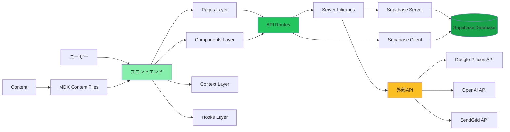

## 主要機能フロー

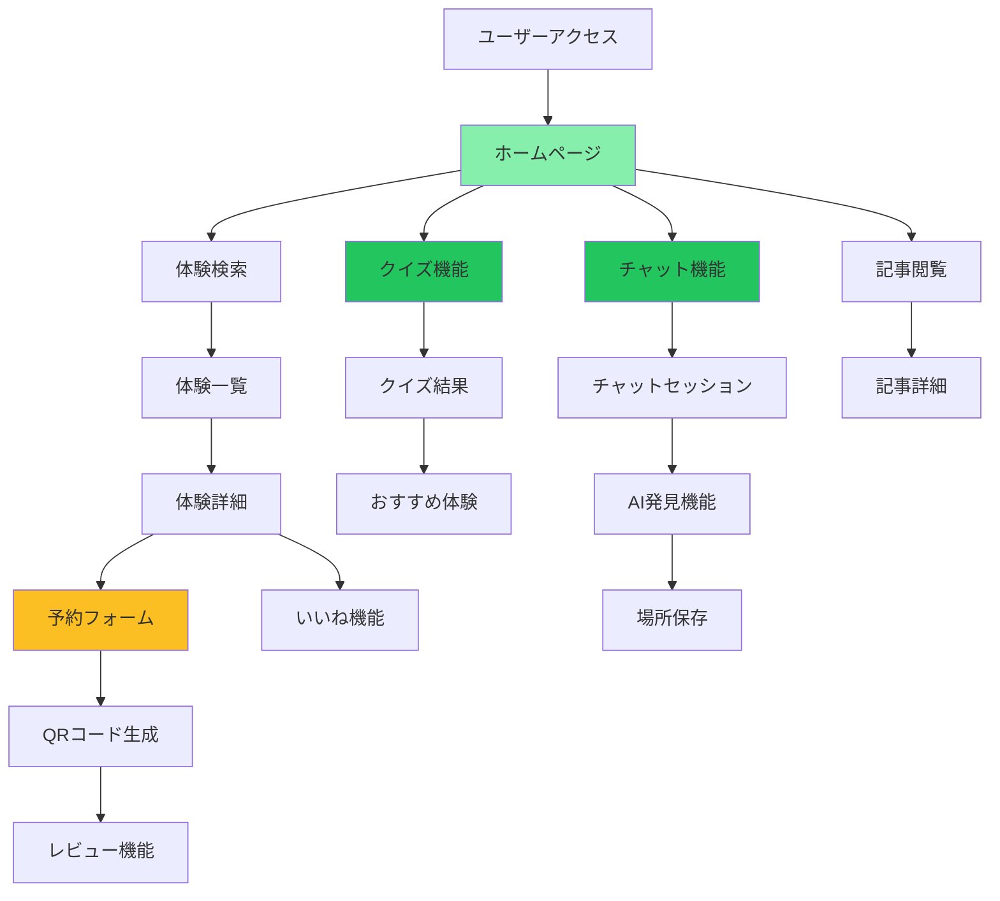

## API構造

```mermaid
graph TB
    API[API Routes] --> AccountAPI[account/]
    API --> ChatAPI[chat/]
    API --> ExperienceAPI[experiences/]
    API --> PlacesAPI[places/]
    API --> ReviewAPI[review/]
    API --> QRAPI[qr/]
    API --> LikesAPI[likes/]
    API --> TrackAPI[track/]
    API --> VendorAPI[vendor/]
    API --> UserAPI[user/]
    
    AccountAPI --> AccountSession[session.ts]
    AccountAPI --> AccountQuizState[quiz-state.ts]
    AccountAPI --> AccountStateSync[state-sync.ts]
    AccountAPI --> AccountLink[link.ts]
    AccountAPI --> AccountLocation[location-permission.ts]
    
    ChatAPI --> ChatSendMessage[send-message.ts]
    ChatAPI --> ChatSessions[sessions/]
    ChatSessions --> ChatSessionIndex[index.ts]
    ChatSessions --> ChatSessionDetail[sessionId.ts]
    ChatSessions --> ChatSessionMessages[messages.ts]
    ChatSessions --> ChatSessionShare[share.ts]
    ChatAPI --> ChatPlaces[places/]
    
    ExperienceAPI --> ExpIndex[index.ts]
    ExperienceAPI --> ExpDetail[slug.ts]
    ExperienceAPI --> ExpAICards[ai-cards.ts]
    ExperienceAPI --> ExpCategories[categories/]
    
    PlacesAPI --> PlacesSearch[search.ts]
    PlacesAPI --> PlacesDetails[details.ts]
    PlacesAPI --> PlacesGeocode[geocode.ts]
    PlacesAPI --> PlacesPhoto[photo.ts]
    
    ReviewAPI --> ReviewSubmit[submit.ts]
    ReviewAPI --> ReviewGenerateQR[generate-qr.ts]
    
    QRAPI --> QRGenerate[generate.ts]
    QRAPI --> QRVerify[verify.ts]
    
    LikesAPI --> LikesSlug[slug.ts]
    LikesAPI --> LikesUser[user.ts]
    
    TrackAPI --> TrackIngest[ingest.ts]
    TrackAPI --> TrackSearch[search.ts]
    TrackAPI --> TrackComplete[complete.ts]
    
    VendorAPI --> VendorLogin[login.ts]
    VendorAPI --> VendorLogout[logout.ts]
    VendorAPI --> VendorSetPassword[set-password.ts]
    VendorAPI --> VendorCompletions[completions.ts]
    
    style API fill:#22c55e
    style ChatAPI fill:#86efac
    style ExperienceAPI fill:#86efac
    style PlacesAPI fill:#86efac
```

## データフロー

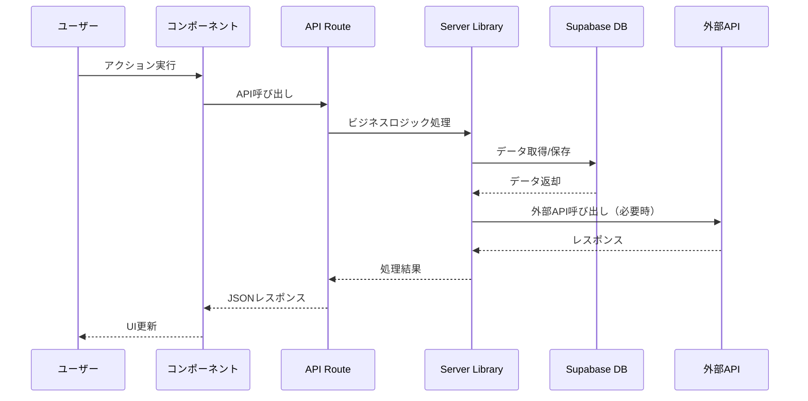

## コンポーネント階層

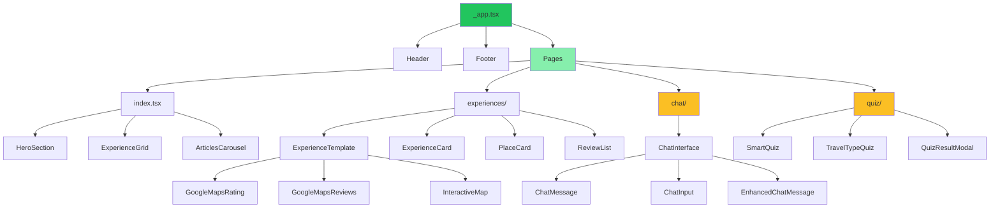

## 認証・セッション管理

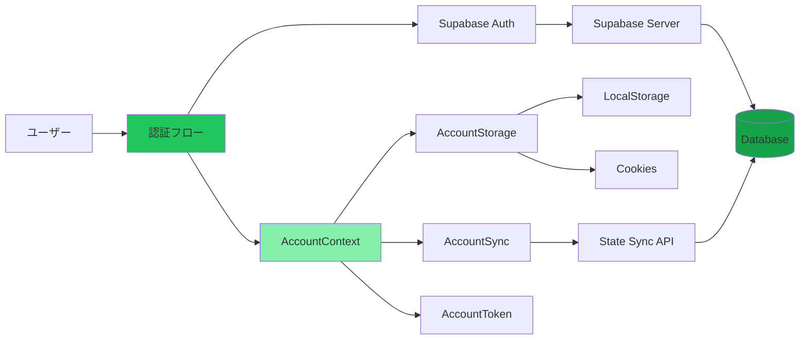

## コンテンツ管理

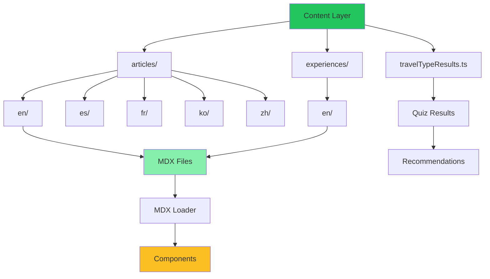

## ライブラリ構造

```mermaid
graph TB
    Lib[lib/] --> Server[server/]
    Lib --> Scoring[scoring/]
    Lib --> Maps[maps/]
    Lib --> Email[emailTemplates/]
    Lib --> Utils[Utilities]
    
    Server --> AccountResolver[accountResolver.ts]
    Server --> ActivityResolver[activityResolver.ts]
    Server --> ApiAuth[apiAuth.ts]
    Server --> ChatSessions[chatSessions.ts]
    Server --> QuizState[quizState.ts]
    Server --> LikeStorage[likeStorage.ts]
    Server --> SupabaseCookies[supabaseCookies.ts]
    
    Scoring --> UserVector[userVector.ts]
    Scoring --> Rank[rank.ts]
    Scoring --> Category[category.ts]
    
    Maps --> Photos[photos.ts]
    
    Email --> Components[components.ts]
    Email --> DesignSystem[designSystem.ts]
    Email --> Experiences[experiences/]
    
    Utils --> SupabaseServer[supabaseServer.ts]
    Utils --> SupabaseAuth[supabaseAuth.ts]
    Utils --> ApiClient[apiClient.ts]
    Utils --> Cache[cache.ts]
    Utils --> RecommendationOrchestrator[recommendationOrchestrator.ts]
    Utils --> ChatSessionsClient[chatSessionsClient.ts]
    Utils --> QuizClientState[quizClientState.ts]
    
    style Lib fill:#22c55e
    style Server fill:#86efac
    style Utils fill:#fbbf24
```

## 外部サービス統合

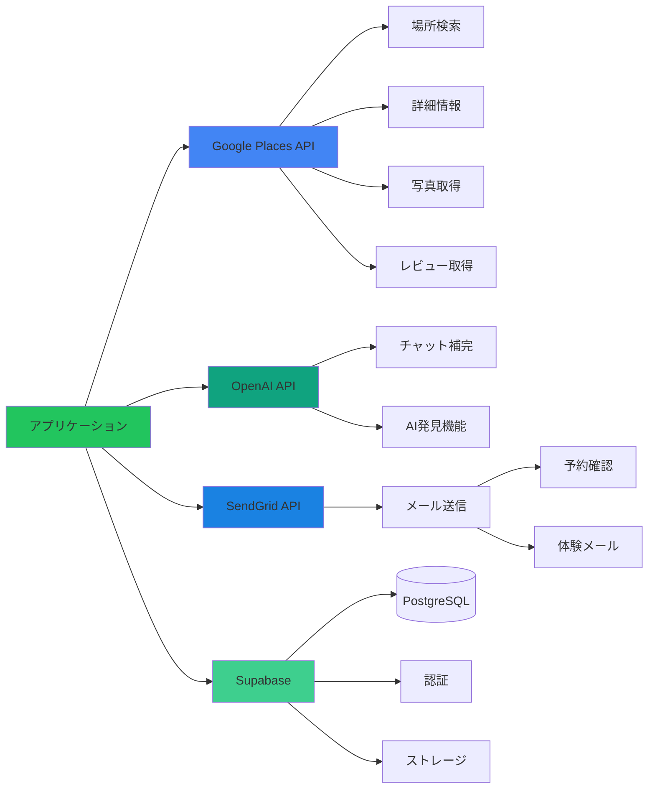

## コンポーネント依存関係詳細図

```mermaid
graph TB
    App[_app.tsx] --> AccountProvider[AccountContext Provider]
    App --> QuizStatusProvider[QuizStatusContext Provider]
    App --> MDXProvider[MDXProvider]
    App --> CookieConsent[CookieConsent]
    App --> QuizResultModal[QuizResultModal]
    
    IndexPage[index.tsx] --> Header[Header]
    IndexPage --> HeroSection[HeroSection]
    IndexPage --> CardGrid[CardGrid]
    IndexPage --> Footer[Footer]
    IndexPage --> LazyExperiencesCarousel[LazyExperiencesCarousel]
    IndexPage --> LazyArticlesCarousel[LazyArticlesCarousel]
    IndexPage --> LazyMotivationCarousel[LazyMotivationCarousel]
    
    ChatPage[chat/index.tsx] --> ChatInterface[ChatInterface]
    ChatInterface --> ChatMessage[ChatMessage]
    ChatInterface --> ChatInput[ChatInput]
    ChatInterface --> EnhancedChatMessage[EnhancedChatMessage]
    
    ExpPage[experiences/index.tsx] --> Header
    ExpPage --> PlaceCard[PlaceCard]
    ExpPage --> Footer
    
    ExpDetailPage[experiences/[slug].tsx] --> ExperienceTemplate[ExperienceTemplate]
    ExperienceTemplate --> ExperienceCard[ExperienceCard]
    ExperienceTemplate --> GoogleMapsRating[GoogleMapsRating]
    ExperienceTemplate --> GoogleMapsReviews[GoogleMapsReviews]
    ExperienceTemplate --> InteractiveMap[InteractiveMap]
    ExperienceTemplate --> ReviewList[ReviewList]
    ExperienceTemplate --> SmartBookingForm[SmartBookingForm]
    
    QuizPage[quiz/index.tsx] --> SmartQuiz[SmartQuiz]
    SmartQuiz --> TravelTypeQuiz[TravelTypeQuiz]
    SmartQuiz --> QuizResultModal
    
    AccountProvider --> AccountStorage[AccountStorage]
    AccountProvider --> AccountSync[AccountSync]
    AccountProvider --> SupabaseAuth[Supabase Auth]
    
    QuizStatusProvider --> QuizClientState[QuizClientState]
    
    style App fill:#22c55e
    style AccountProvider fill:#86efac
    style ChatInterface fill:#fbbf24
    style ExperienceTemplate fill:#fbbf24
```

## 状態管理フロー

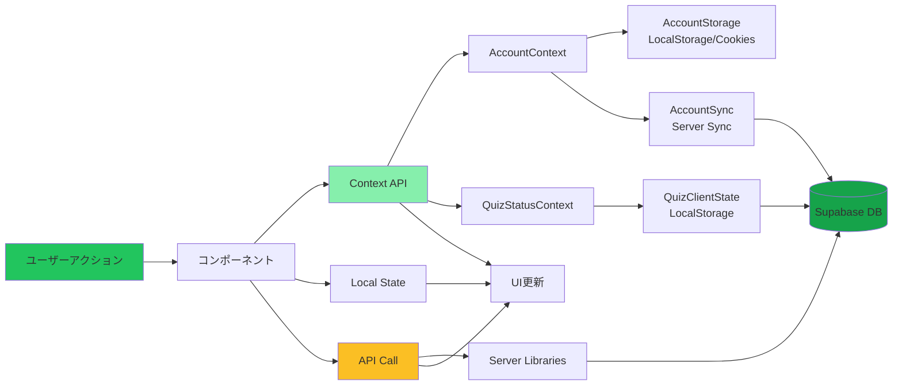

## チャット機能の詳細フロー

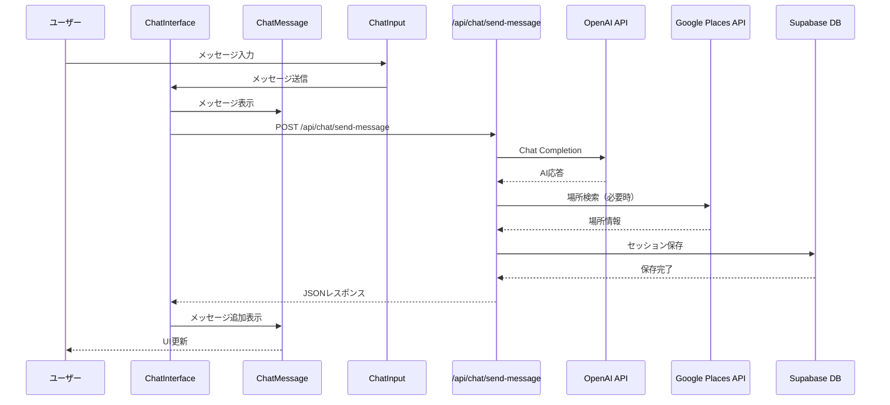

## 体験予約フロー

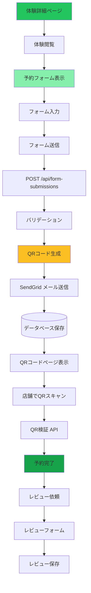

## クイズ・レコメンデーションシステム

```mermaid
graph TB
    Start[クイズ開始] --> QuizQuestions[質問表示]
    QuizQuestions --> UserAnswer[ユーザー回答]
    UserAnswer --> CalculateScore[スコア計算]
    
    CalculateScore --> DetermineType[旅行タイプ判定]
    DetermineType --> SaveResult[結果保存]
    
    SaveResult --> LocalStorage[LocalStorage保存]
    SaveResult --> ServerSync[サーバー同期]
    
    ServerSync --> AccountMetadata[(Account Metadata)]
    
    LocalStorage --> ShowResult[結果表示]
    ShowResult --> Recommendations[レコメンデーション生成]
    
    Recommendations --> RecommendAPI[/api/recommend]
    RecommendAPI --> ScoringSystem[スコアリングシステム]
    
    ScoringSystem --> UserVector[User Vector計算]
    ScoringSystem --> CategoryScore[カテゴリスコア]
    ScoringSystem --> RankScore[ランクスコア]
    
    ScoringSystem --> GooglePlaces[Google Places検索]
    GooglePlaces --> FilterResults[結果フィルタリング]
    FilterResults --> ReturnResults[結果返却]
    
    ReturnResults --> DisplayRec[レコメンデーション表示]
    
    style Start fill:#22c55e
    style DetermineType fill:#86efac
    style ScoringSystem fill:#fbbf24
    style DisplayRec fill:#16a34a
```

## データベースエンティティ関係図

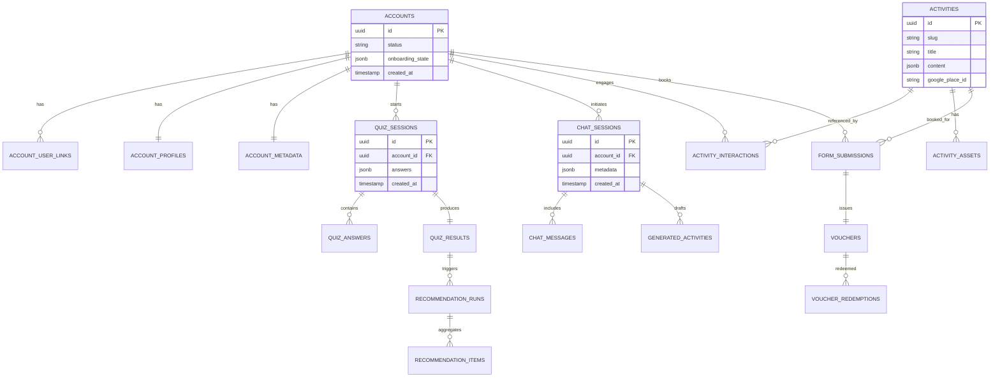

## ページルーティング構造

```mermaid
graph TB
    Root[/] --> Home[index.tsx]
    Root --> Experiences[/experiences]
    Root --> Articles[/articles]
    Root --> Chat[/chat]
    Root --> Quiz[/quiz]
    Root --> Auth[/auth]
    
    Experiences --> ExpList[/experiences/index.tsx]
    Experiences --> ExpDetail[/experiences/[slug].tsx]
    
    Articles --> ArticleList[/articles/index.tsx]
    Articles --> ArticleDetail[/articles/[slug].tsx]
    
    Chat --> ChatPage[/chat/index.tsx]
    
    Quiz --> QuizPage[/quiz/index.tsx]
    Quiz --> QuizShare[/quiz/share-card.tsx]
    
    Auth --> AuthCallback[/auth/callback.tsx]
    
    Root --> Business[/business]
    Business --> BusinessVisits[/business/visits.tsx]
    Business --> ReviewQR[/business/review-qr/[bookingId].tsx]
    
    Root --> Review[/review/[bookingId].tsx]
    Root --> Track[/track/[bookingId].tsx]
    Root --> QR[/qr/[bookingId].tsx]
    Root --> Share[/share/[token].tsx]
    
    Root --> StaticPages[静的ページ]
    StaticPages --> AboutUs[/about-us.tsx]
    StaticPages --> ContactUs[/contact-us.tsx]
    StaticPages --> PrivacyPolicy[/privacy-policy.tsx]
    StaticPages --> TermsOfUse[/terms-of-use.tsx]
    
    style Root fill:#22c55e
    style Home fill:#86efac
    style Chat fill:#fbbf24
    style Quiz fill:#fbbf24
    style Business fill:#16a34a
```

## 認証・セッション管理詳細フロー

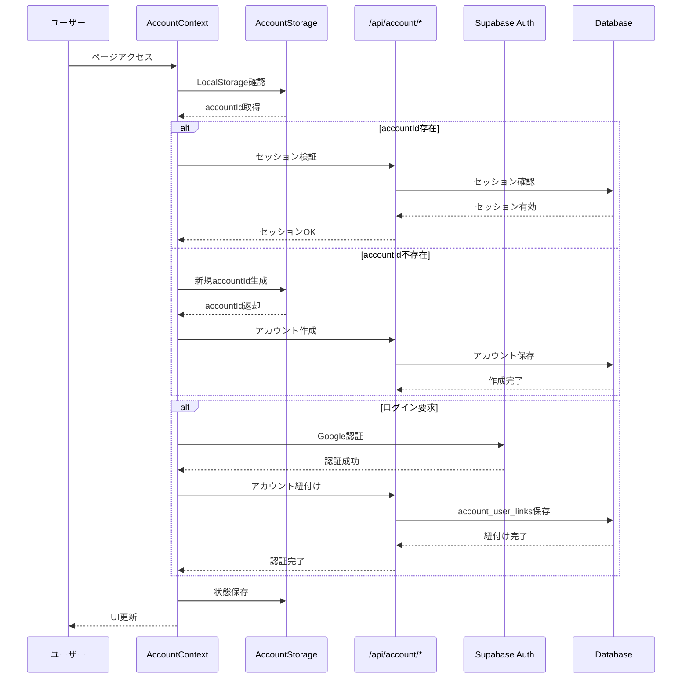


