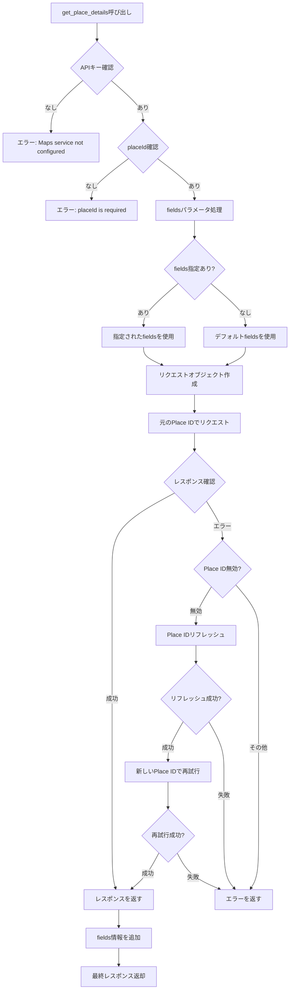
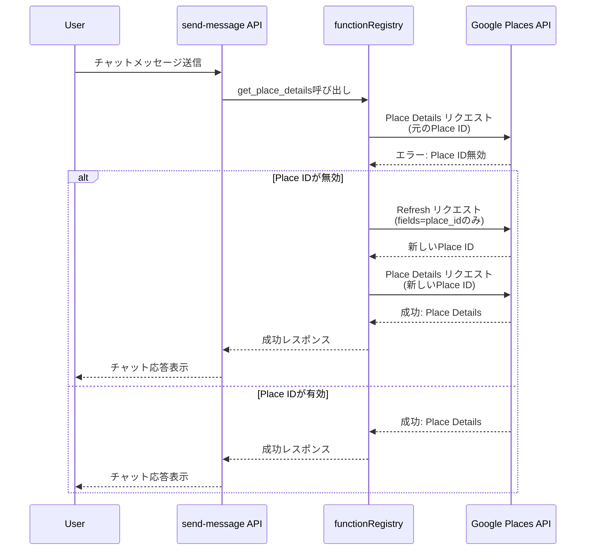
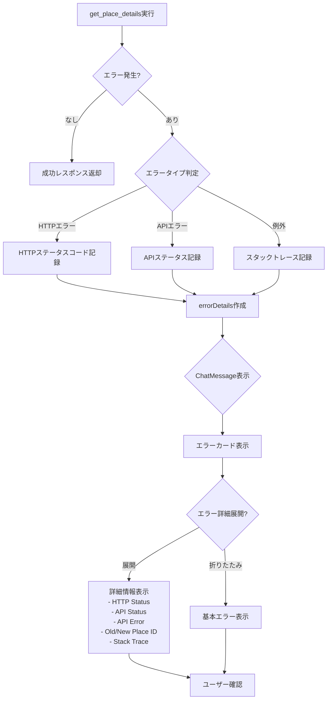
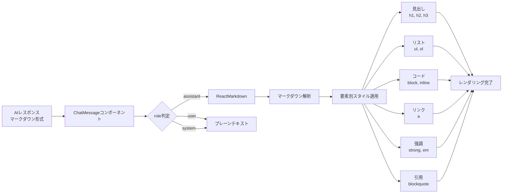
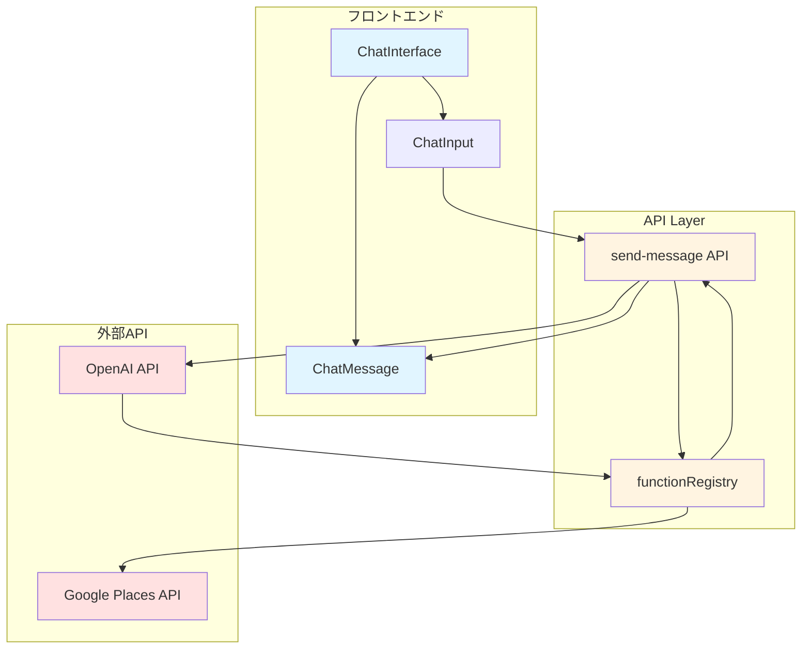
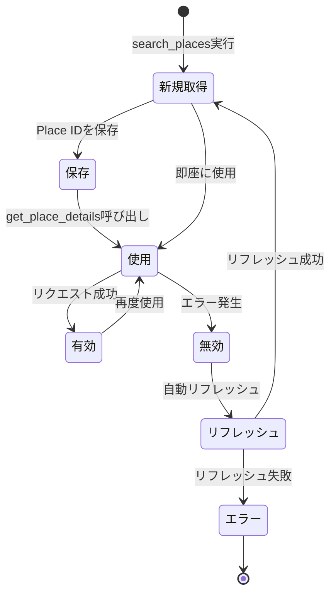
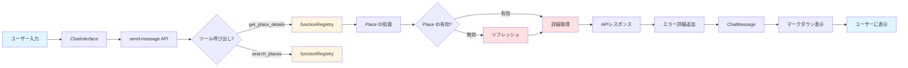

# システムフロー図 - 2024年12月20日の変更

## get_place_details関数の実行フロー

```mermaid
flowchart TD
    A[get_place_details呼び出し] --> B{APIキー確認}
    B -->|なし| C[エラー: Maps service not configured]
    B -->|あり| D{placeId確認}
    D -->|なし| E[エラー: placeId is required]
    D -->|あり| F[fieldsパラメータ処理]
    F --> G{fields指定あり?}
    G -->|あり| H[指定されたfieldsを使用]
    G -->|なし| I[デフォルトfieldsを使用]
    H --> J[リクエストオブジェクト作成]
    I --> J
    J --> K[元のPlace IDでリクエスト]
    K --> L{レスポンス確認}
    L -->|成功| M[レスポンスを返す]
    L -->|エラー| N{Place ID無効?}
    N -->|無効| O[Place IDリフレッシュ]
    N -->|その他| P[エラーを返す]
    O --> Q{リフレッシュ成功?}
    Q -->|成功| R[新しいPlace IDで再試行]
    Q -->|失敗| P
    R --> S{再試行成功?}
    S -->|成功| M
    S -->|失敗| P
    M --> T[fields情報を追加]
    T --> U[最終レスポンス返却]
```

## Place IDリフレッシュの詳細フロー

```mermaid
sequenceDiagram
    participant User
    participant API as send-message API
    participant Registry as functionRegistry
    participant Google as Google Places API
    
    User->>API: チャットメッセージ送信
    API->>Registry: get_place_details呼び出し
    Registry->>Google: Place Details リクエスト<br/>(元のPlace ID)
    Google-->>Registry: エラー: Place ID無効
    
    alt Place IDが無効
        Registry->>Google: Refresh リクエスト<br/>(fields=place_idのみ)
        Google-->>Registry: 新しいPlace ID
        Registry->>Google: Place Details リクエスト<br/>(新しいPlace ID)
        Google-->>Registry: 成功: Place Details
        Registry-->>API: 成功レスポンス
        API-->>User: チャット応答表示
    else Place IDが有効
        Google-->>Registry: 成功: Place Details
        Registry-->>API: 成功レスポンス
        API-->>User: チャット応答表示
    end
```

## エラーハンドリングフロー

```mermaid
flowchart TD
    A[get_place_details実行] --> B{エラー発生?}
    B -->|なし| C[成功レスポンス返却]
    B -->|あり| D{エラータイプ判定}
    D -->|HTTPエラー| E[HTTPステータスコード記録]
    D -->|APIエラー| F[APIステータス記録]
    D -->|例外| G[スタックトレース記録]
    E --> H[errorDetails作成]
    F --> H
    G --> H
    H --> I{ChatMessage表示}
    I --> J[エラーカード表示]
    J --> K{エラー詳細展開?}
    K -->|展開| L[詳細情報表示<br/>- HTTP Status<br/>- API Status<br/>- API Error<br/>- Old/New Place ID<br/>- Stack Trace]
    K -->|折りたたみ| M[基本エラー表示]
    L --> N[ユーザー確認]
    M --> N
```

## マークダウン表示フロー

```mermaid
flowchart LR
    A[AIレスポンス<br/>マークダウン形式] --> B[ChatMessageコンポーネント]
    B --> C{role判定}
    C -->|assistant| D[ReactMarkdown]
    C -->|user| E[プレーンテキスト]
    C -->|system| E
    D --> F[マークダウン解析]
    F --> G[要素別スタイル適用]
    G --> H[見出し<br/>h1, h2, h3]
    G --> I[リスト<br/>ul, ol]
    G --> J[コード<br/>block, inline]
    G --> K[リンク<br/>a]
    G --> L[強調<br/>strong, em]
    G --> M[引用<br/>blockquote]
    H --> N[レンダリング完了]
    I --> N
    J --> N
    K --> N
    L --> N
    M --> N
```

## システム全体のアーキテクチャ

```mermaid
graph TB
    subgraph "フロントエンド"
        A[ChatInterface]
        B[ChatMessage]
        C[ChatInput]
    end
    
    subgraph "API Layer"
        D[send-message API]
        E[functionRegistry]
    end
    
    subgraph "外部API"
        F[OpenAI API]
        G[Google Places API]
    end
    
    A --> B
    A --> C
    C --> D
    D --> E
    D --> F
    E --> G
    F --> E
    E --> D
    D --> B
    
    style A fill:#e1f5ff
    style B fill:#e1f5ff
    style D fill:#fff4e1
    style E fill:#fff4e1
    style F fill:#ffe1e1
    style G fill:#ffe1e1
```

## Place IDライフサイクル

```mermaid
stateDiagram-v2
    [*] --> 新規取得: search_places実行
    新規取得 --> 保存: Place IDを保存
    保存 --> 使用: get_place_details呼び出し
    使用 --> 有効: リクエスト成功
    使用 --> 無効: エラー発生
    無効 --> リフレッシュ: 自動リフレッシュ
    リフレッシュ --> 新規取得: リフレッシュ成功
    リフレッシュ --> エラー: リフレッシュ失敗
    有効 --> 使用: 再度使用
    新規取得 --> 使用: 即座に使用
    エラー --> [*]
```

## データフロー

```mermaid
flowchart LR
    A[ユーザー入力] --> B[ChatInterface]
    B --> C[send-message API]
    C --> D{ツール呼び出し?}
    D -->|get_place_details| E[functionRegistry]
    D -->|search_places| F[functionRegistry]
    E --> G[Place ID処理]
    G --> H{Place ID有効?}
    H -->|無効| I[リフレッシュ]
    H -->|有効| J[詳細取得]
    I --> J
    J --> K[APIレスポンス]
    K --> L[エラー詳細追加]
    L --> M[ChatMessage]
    M --> N[マークダウン表示]
    N --> O[ユーザーに表示]
    
    style A fill:#e1f5ff
    style O fill:#e1f5ff
    style E fill:#fff4e1
    style F fill:#fff4e1
    style I fill:#ffe1e1
    style J fill:#ffe1e1
```

