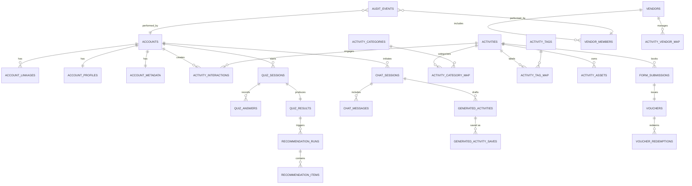

# ER Diagram

以下は `docs/database_design.md` で定義された論理モデルを基にした主要テーブル間のER図です。Mermaid記法で記述しているため、対応エディタやGitHub上で視覚化できます。

## ノート
- 実線は必須関係 (`NOT NULL` FK)、丸付き線は任意関係を示しています。
- `AUDIT_EVENTS` は対象エンティティを `entity_type` / `entity_id` の組み合わせで参照するポリモーフィック関連を想定しています。
- 補助テーブル（例: `activity_locations`）はオプショナル要素としてER図には含めていません。

