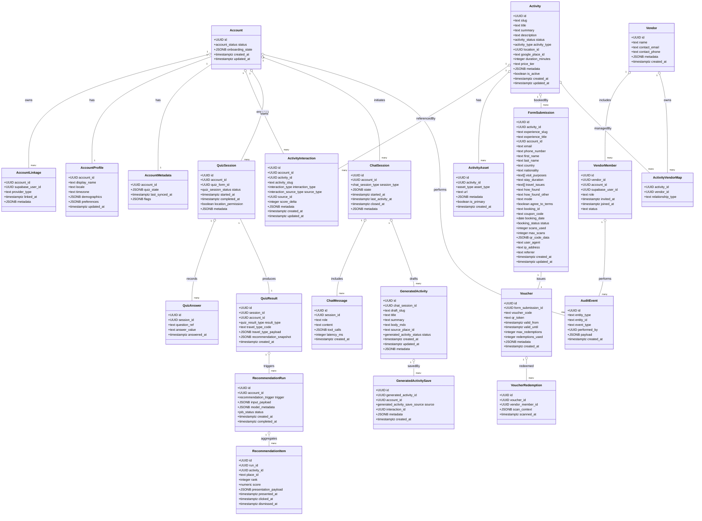

# Domain UML Diagram

主要ドメインエンティティの属性と関連をクラス図として表現します。ER図と比較して、ドメインモデルの責務やカードinalityだけでなく、列属性の概要も把握できる構成です。

## モデリング方針との対応
- クラス図のプロパティは論理設計で定義されたカラムをそのまま掲載しています。
- ER図に含めなかった補助テーブル（例: `activity_locations`）は、将来拡張としてコメント節で扱う方針です。
- 多態関連（`AuditEvent.performed_by`）は、実際には `entity_type` / `entity_id` の組で対象レコードへ解決する想定です。

